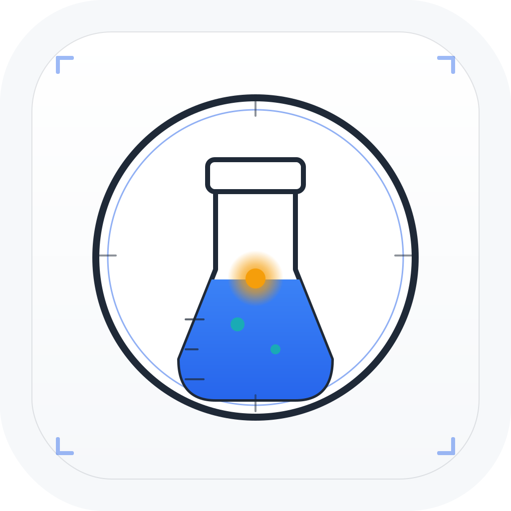

# SessionLedger

<p align="center">
  <a href="assets/brand/sessionledger-icon.svg"></a>
</p>
<p align="center"><em>OKF-native session compiler — capture, archive, replay AI agent sessions losslessly.</em></p>
<p align="center"><sub>Lab-Coat palette · <a href="assets/brand/README.md">brand assets &amp; tokens</a> · OKF v1.0 spec</sub></p>

---

> Capture, archive, and replay your AI sessions. OKF-native session compiler.

## Features
- **sl-daemon**: HTTP API — bundle ingest, search, replay SSE, metrics
- **sl-viewer**: Dioxus desktop app with Timeline, Search, Replay, LiveFeed tabs
- **OKF validation**: POST /api/ingest validates bundle schema
- **Archive/restore**: gzip-compressed archival with flate2
- **Filter flags**: --since, --until, --model, --min-tokens, --tag, --limit
- **Dark/light theme**: #7c3aed accent, #06b6d4 secondary
- **Startup banner**: colored ANSI branding

## Quick Start
```
make dev
# or separately:
cargo run -p sl-daemon -- serve
cargo run -p sl-viewer
```

## API
| Endpoint | Description |
|----------|-------------|
| GET /healthz | Liveness |
| GET /api/bundles | List bundles |
| GET /api/search | Filter bundles |
| GET /api/metrics | Session statistics |
| GET /api/replay/:id | SSE replay |
| POST /api/ingest | Validate + ingest |

## Deploy
```
podman build -t sl-daemon .
podman run -v sl-data:/data -p 8080:8080 sl-daemon
```
