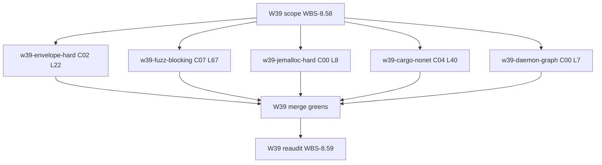

# WORK_DAG — task dependencies

Compact view of [`PLAN.md`](PLAN.md). Solid boxes = done; dashed = todo.

```mermaid
flowchart TD
  subgraph done [Done]
    T001[T-001 domain/DESIGN]
    T002[T-002 OKF spec]
    T003[T-003 roundtrip smoke]
    T004[T-004 brand]
    T005[T-005 L128 daemon]
    T006[T-006 ingest validate]
    T007[T-007 search]
    T008[T-008 replay SSE]
    T009[T-009 metrics]
    T010[T-010 archive]
    T011[T-011 viewer tabs]
    T012[T-012 process-compose]
    T013[T-013 AGENTS]
    T014[T-014 FR/PLAN/ops]
    T020[T-020 FR links in tests]
    T021[T-021 structured tracing]
    T022[T-022 log levels]
    T023[T-023 OTel soft goal]
    T024[T-024 crash detector]
    T025[T-025 FR-gap CI note]
    T030[T-030 Contract/Dedup]
    T031[T-031 inject renderer]
  end

  subgraph p1 [P1 done]
    T032[T-032 forge sqlite]
    T033[T-033 JSONL adapters]
    T034[T-034 port adapters]
    T035[T-035 merge/recovery]
    T038[T-038 coverage]
  end

  T001 --> T005
  T001 --> T030
  T002 --> T003
  T002 --> T006
  T005 --> T006
  T005 --> T007
  T005 --> T008
  T005 --> T009
  T005 --> T010
  T005 --> T011
  T005 --> T012
  T003 --> T011
  T014 --> T020
  T014 --> T023
  T014 --> T025
  T005 --> T021
  T021 --> T022
  T005 --> T024
  T001 --> T024
  T030 --> T031
  T005 --> T032
  T005 --> T033
  T032 --> T034
  T024 --> T035
  T030 --> T035
  T024 --> T036
  T003 --> T037
  T032 --> T038
```

## Bullet form

- **Foundation (done):** T-001 → T-005 → {T-006…T-012}; T-002 → T-003; T-004, T-013, T-014 parallel docs/brand.
- **P0 obs (done):** T-014 → {T-020, T-023, T-025}; T-005 → T-021 → T-022.
- **P0 recovery (done):** T-005+T-001 → T-024.
- **P1 depth (done):** T-032…T-038 landed Wave-5 (#100–#103).

## Wave-39 (audit-v38 391/402 → target 392+)

- **Scope:** [`WAVE39_SCOPE.md`](WAVE39_SCOPE.md); PERT: [`docs/ops/WAVE39_PERT.md`](docs/ops/WAVE39_PERT.md)
- **Merge order (suggested):** envelope → fuzz → jemalloc → cargo-nonet → daemon-graph
- **Reaudit conservative candidates:** C00 L8, C07 L67, C02 L22 (+1 each); L7/L40 held at pillar max
