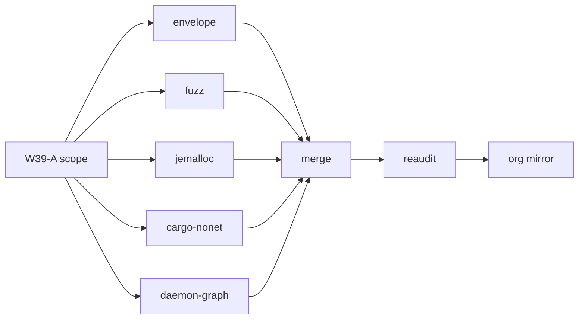

# Wave-39 PERT — SessionLedger

Companion to [`WAVE39_SCOPE.md`](../../WAVE39_SCOPE.md) and [`WORK_DAG.md`](../../WORK_DAG.md).

## Activity table

| ID | Activity | Pred | Est (h) | Owner |
|----|----------|------|---------|-------|
| W39-A | Scope + WBS/DAG/PERT artifacts | — | 1 | machine |
| W39-B1 | w39-envelope-hard impl | W39-A | 3 | machine |
| W39-B2 | w39-fuzz-blocking impl | W39-A | 3 | machine |
| W39-B3 | w39-jemalloc-hard impl | W39-A | 2 | machine |
| W39-B4 | w39-cargo-nonet impl | W39-A | 2 | machine |
| W39-B5 | w39-daemon-graph impl | W39-A | 4 | machine |
| W39-C | Merge 5 feature PRs (sequential) | B1–B5 | 2 | machine |
| W39-D | Reaudit + traceability refresh | W39-C | 2 | machine |
| W39-E | Org mirror PR | W39-D | 1 | human (repo archived) |

**Parallel width:** 5 (B1–B5). **Critical path:** A → B5 → C → D (~9h nominal).

## Mermaid PERT (simplified)

