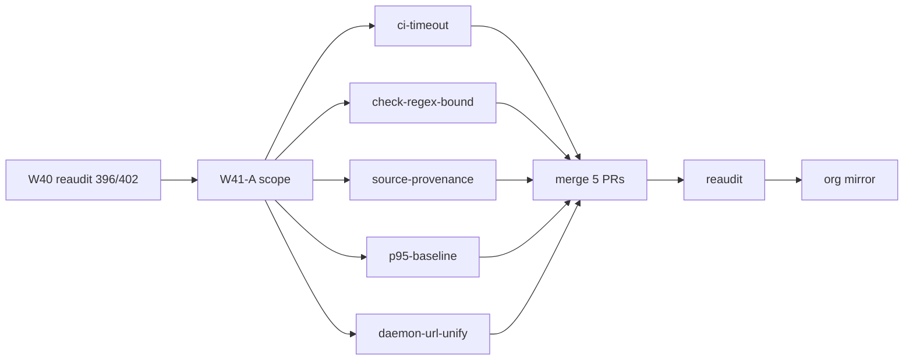

# Wave-41 PERT — SessionLedger (consolidated)

Companion to [`WAVE41_SCOPE.md`](../../WAVE41_SCOPE.md) (repo root).

**Base:** `origin/main` @ `789c7f3` (**396/402 · 98% A**)  
**Width:** 5 parallel lanes · **Theme:** cross-pillar hardening (DX bugfix + CI stability + governance traceability + perf baseline)

## Activity table

| ID | Activity | Pred | Est (h) | Owner |
|----|----------|------|---------|-------|
| W41-A | Scope PR (`WAVE41_SCOPE.md` + this PERT + CHANGELOG) | W40 reaudit (#329) | 2 | machine |
| W41-B1 | w41-ci-timeout — workflow `timeout-minutes` | W41-A | 2 | machine |
| W41-B2 | w41-check-regex-bound — line-scanner YAML extraction | W41-A | 2 | machine |
| W41-B3 | w41-source-provenance — `tests/source_provenance.rs` wrapper | W41-A | 1 | machine |
| W41-B4 | w41-p95-baseline — Criterion-measured p95 refresh | W41-A | 3 | machine |
| W41-B5 | w41-daemon-url-unify — viewer daemon URL module + Live Feed fix | W41-A | 3 | machine |
| W41-C | Merge 5 feature PRs (sequential) | B1–B5 | 2 | machine |
| W41-D | Reaudit + traceability refresh | W41-C | 2 | machine |
| W41-E | Org mirror PR to phenotype-org-audits | W41-D | 2 | human (repo archived) |

**Parallel width:** 5 (B1–B5). **Critical path:** A → **B5** (daemon-url-unify, viewer touch) → C → D (~12h nominal).

## Merge order (lowest conflict risk)

1. **w41-ci-timeout** — `.github/workflows/*.yml` only  
2. **w41-check-regex-bound** — `scripts/sandbox-boundary-check.ps1`, `scripts/oci-cosign-verify.ps1`  
3. **w41-source-provenance** — `tests/source_provenance.rs`, optional `scripts/` hook  
4. **w41-p95-baseline** — `docs/ops/perf-baseline.json`, optional `scripts/bench-gate.ps1`  
5. **w41-daemon-url-unify** — `crates/sl-viewer/` (conflict-prone; merge last)

## Lane detail (acceptance stubs)

| Lane | Key files | Acceptance |
|------|-----------|------------|
| w41-ci-timeout | `ci.yml`, `security.yml`, `qgate.yml`, `commit-signing.yml` | Every job has explicit `timeout-minutes`; no workflow relies on 6h default |
| w41-check-regex-bound | `sandbox-boundary-check.ps1`, `oci-cosign-verify.ps1` | YAML job blocks extracted via line scanner; `-SelfCheck` green; no `(?ms).*?` lazy spans |
| w41-source-provenance | `tests/source_provenance.rs` | `cargo test source_provenance` spawns `source-provenance-check.ps1 -SelfCheck`; TRACEABILITY chain closed |
| w41-p95-baseline | `perf-baseline.json`, `bench-gate.ps1` | ≥1 benchmark p95 diverges from `mean×1.15`; full `bench-gate.ps1` PASS on CI |
| w41-daemon-url-unify | `sl-viewer` URL module, `live_feed.rs`, `search_view.rs`, `replay_view.rs` | Live Feed connects on default `make dev`; single `SL_DAEMON_URL` source |

## Mermaid PERT (simplified)



## Deferred lanes (not in critical path)

| Lane | Est (h) | Reason deferred |
|------|---------|-----------------|
| w41-daemon-graph-hard | 8 | Longest stability lane; C00 L7 already pillar max |
| w41-signing-check-bound | 3 | Overlaps regex-bound; separate if signing loop needs IO cap |
| w41-sbom-validate | 3 | Governance wave-2 |
| w41-first-run-cta | 2 | P2 DX polish |

## Worktree bootstrap

```powershell
git -C C:\Users\koosh\SessionLedger fetch origin
$lanes = @(
  @{ name = 'w41-ci-timeout'; branch = 'feat/sl-w41-ci-timeout' },
  @{ name = 'w41-check-regex-bound'; branch = 'feat/sl-w41-check-regex-bound' },
  @{ name = 'w41-source-provenance'; branch = 'feat/sl-w41-source-provenance' },
  @{ name = 'w41-p95-baseline'; branch = 'feat/sl-w41-p95-baseline' },
  @{ name = 'w41-daemon-url-unify'; branch = 'feat/sl-w41-daemon-url' }
)
foreach ($lane in $lanes) {
  git -C C:\Users\koosh\SessionLedger worktree add -B $lane.branch `
    "C:\Users\koosh\SessionLedger-wtrees\$($lane.name)" origin/main
}
```
