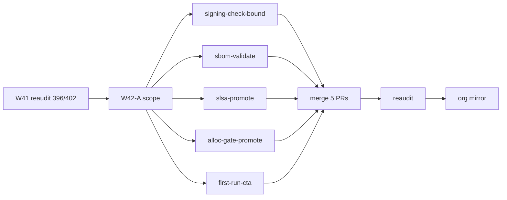

# Wave-42 PERT — SessionLedger (carry-forward)

Companion to [`WAVE42_SCOPE.md`](../../WAVE42_SCOPE.md) (repo root).

**Base:** `origin/main` @ `2187b15` (**396/402 · 98% A**)  
**Width:** 5 parallel lanes · **Theme:** soft→blocking promotions + governance script hardening + viewer onboarding

## Activity table

| ID | Activity | Pred | Est (h) | Owner |
|----|----------|------|---------|-------|
| W42-A | Scope PR (`WAVE42_SCOPE.md` + this PERT + CHANGELOG) | Wave-41 reaudit (#338) | 2 | machine |
| W42-B1 | w42-signing-check-bound — `commit-signing-check.ps1` IO bounds | W42-A | 2 | machine |
| W42-B2 | w42-sbom-validate — pinned cyclonedx + schema gate | W42-A | 3 | machine |
| W42-B3 | w42-slsa-promote — blocking protected-env check | W42-A | 2 | machine |
| W42-B4 | w42-alloc-gate-promote — blocking alloc-profile / dhat | W42-A | 2 | machine |
| W42-B5 | w42-first-run-cta — viewer first-run corpus CTA | W42-A | 2 | machine |
| W42-C | Merge 5 feature PRs (sequential) | B1–B5 | 2 | machine |
| W42-D | Reaudit + traceability refresh | W42-C | 2 | machine |
| W42-E | Org mirror PR to phenotype-org-audits | W42-D | 2 | human (repo archived) |

**Parallel width:** 5 (B1–B5). **Critical path:** A → **B2** (sbom-validate, release workflow touch) → C → D (~13h nominal).

## Merge order (lowest conflict risk)

1. **w42-signing-check-bound** — `scripts/commit-signing-check.ps1` only  
2. **w42-sbom-validate** — `.github/workflows/release.yml`, `scripts/` SBOM hooks  
3. **w42-slsa-promote** — `.github/workflows/slsa-protected-env.yml` (or security.yml anchors)  
4. **w42-alloc-gate-promote** — `.github/workflows/hermetic.yml`, `scripts/alloc-profile-check.ps1`  
5. **w42-first-run-cta** — `crates/sl-viewer/` (conflict-prone; merge last)

## Lane detail (acceptance stubs)

| Lane | Key files | Acceptance |
|------|-----------|------------|
| w42-signing-check-bound | `scripts/commit-signing-check.ps1` | Bounded `git cat-file` / line-scanner; `-SelfCheck` green; no unbounded regex loops |
| w42-sbom-validate | `release.yml`, SBOM validation script | Pinned `cargo-cyclonedx` installer; schema validation on PR + release artifacts |
| w42-slsa-promote | `slsa-protected-env-check.ps1`, workflow | Protected-env check blocking on PRs; no `continue-on-error` bypass |
| w42-alloc-gate-promote | `alloc-profile-check.ps1`, `hermetic.yml` | dhat/alloc-profile jobs blocking; `-SelfCheck` green |
| w42-first-run-cta | `sl-viewer` first-run shell | “Open corpus…” CTA navigates to corpus picker or quick-start; viewer tests green |

## Mermaid PERT (simplified)



## Deferred lanes (not in critical path)

| Lane | Est (h) | Reason deferred |
|------|---------|-----------------|
| w42-daemon-graph-hard | 8 | Longest stability lane; C00 L7 already pillar max |
| w42-jemalloc-default-on | 4 | Windows parity + default-on policy decision |
| w42-load-macro-gate | 3 | C08 L73 breadth; lower ROI than governance hardening |
| w42-sl-viewer-help | 2 | P2 DX polish |

## Worktree bootstrap

```powershell
git -C C:\Users\koosh\SessionLedger fetch origin
$lanes = @(
  @{ name = 'w42-signing-check-bound'; branch = 'feat/sl-w42-signing-check-bound' },
  @{ name = 'w42-sbom-validate'; branch = 'feat/sl-w42-sbom-validate' },
  @{ name = 'w42-slsa-promote'; branch = 'feat/sl-w42-slsa-promote' },
  @{ name = 'w42-alloc-gate-promote'; branch = 'feat/sl-w42-alloc-gate-promote' },
  @{ name = 'w42-first-run-cta'; branch = 'feat/sl-w42-first-run-cta' }
)
foreach ($lane in $lanes) {
  git -C C:\Users\koosh\SessionLedger worktree add -B $lane.branch `
    "C:\Users\koosh\SessionLedger-wtrees\$($lane.name)" origin/main
}
```
