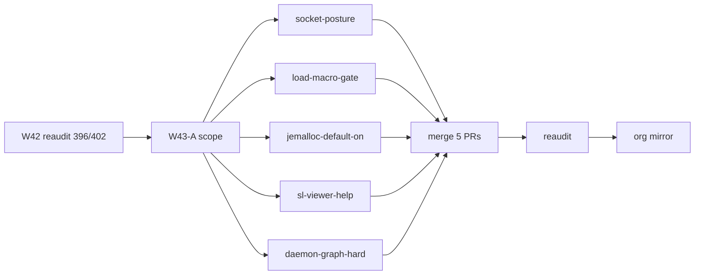

# Wave-43 PERT — SessionLedger (carry-forward)

Companion to [`WAVE43_SCOPE.md`](../../WAVE43_SCOPE.md) (repo root).

**Base:** `origin/main` @ `5598dfa` (**396/402 · 98% A**)  
**Width:** 5 parallel lanes · **Theme:** concurrency depth + allocator policy + load eval + viewer DX + supply-chain telemetry

## Activity table

| ID | Activity | Pred | Est (h) | Owner |
|----|----------|------|---------|-------|
| W43-A | Scope PR (`WAVE43_SCOPE.md` + this PERT + CHANGELOG) | Wave-42 reaudit (#345) | 2 | machine |
| W43-B1 | w43-socket-posture — Socket.dev SelfCheck + docs | W43-A | 2 | machine |
| W43-B2 | w43-load-macro-gate — blocking load-smoke macro routes | W43-A | 3 | machine |
| W43-B3 | w43-jemalloc-default-on — default-on feature + Windows parity | W43-A | 4 | machine |
| W43-B4 | w43-sl-viewer-help — expand viewer CLI help | W43-A | 2 | machine |
| W43-B5 | w43-daemon-graph-hard — tokio broadcast/SSE graph ports | W43-A | 8 | machine |
| W43-C | Merge 5 feature PRs (sequential) | B1–B5 | 2 | machine |
| W43-D | Reaudit + traceability refresh | W43-C | 2 | machine |
| W43-E | Org mirror PR to phenotype-org-audits | W43-D | 2 | human (repo archived) |

**Parallel width:** 5 (B1–B5). **Critical path:** A → **B5** (daemon-graph-hard) → C → D (~21h nominal).

## Merge order (lowest conflict risk)

1. **w43-socket-posture** — docs + `security.yml` / SelfCheck only  
2. **w43-load-macro-gate** — `scripts/load-smoke.ps1`, workflow anchors  
3. **w43-jemalloc-default-on** — `Cargo.toml`, `jemalloc-check.ps1`, docs  
4. **w43-sl-viewer-help** — `crates/sl-viewer/src/main.rs`, HELP cross-links  
5. **w43-daemon-graph-hard** — `tests/loom_model.rs`, `sl-daemon` graph (conflict-prone; merge last)

## Lane detail (acceptance stubs)

| Lane | Key files | Acceptance |
|------|-----------|------------|
| w43-socket-posture | `scripts/socket-posture-check.ps1`, docs | SelfCheck green; PR workflow anchor documented |
| w43-load-macro-gate | `load-smoke.ps1`, workflow | Macro route tier blocking on PR; `-SelfCheck` green |
| w43-jemalloc-default-on | `sl-daemon` features, `jemalloc.md` | Default-on policy documented; Windows parity path; tests green |
| w43-sl-viewer-help | `sl-viewer/main.rs` | `--help` lists env vars + doc URLs; `cargo test -p sl-viewer` |
| w43-daemon-graph-hard | `loom_model.rs`, concurrency docs | Full tokio broadcast/SSE graph in blocking permutation; CI green |

## Mermaid PERT (simplified)



## Deferred lanes (not in critical path)

| Lane | Est (h) | Reason deferred |
|------|---------|-----------------|
| w43-fluent-viewer-stub | 6 | C01 L16 breadth; viewer string migration |
| w43-export-skip-summary | 2 | P2 CLI polish |
| w43-sbom-pillar-close | 2 | C04 L32 needs auditor buy-in for +1 |

## Worktree bootstrap

```powershell
git -C C:\Users\koosh\SessionLedger fetch origin
$lanes = @(
  @{ name = 'w43-socket-posture'; branch = 'feat/sl-w43-socket-posture' },
  @{ name = 'w43-load-macro-gate'; branch = 'feat/sl-w43-load-macro-gate' },
  @{ name = 'w43-jemalloc-default-on'; branch = 'feat/sl-w43-jemalloc-default-on' },
  @{ name = 'w43-sl-viewer-help'; branch = 'feat/sl-w43-sl-viewer-help' },
  @{ name = 'w43-daemon-graph-hard'; branch = 'feat/sl-w43-daemon-graph-hard' }
)
foreach ($lane in $lanes) {
  git -C C:\Users\koosh\SessionLedger worktree add -B $lane.branch `
    "C:\Users\koosh\SessionLedger-wtrees\$($lane.name)" origin/main
}
```
